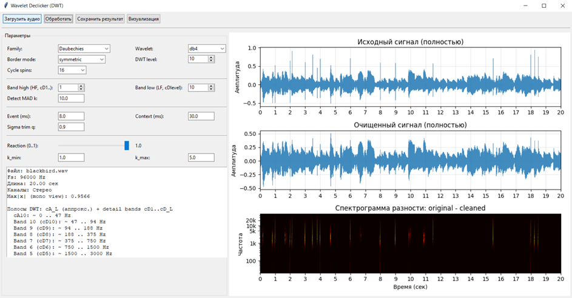

# Wavelet-Based Audio Declicker



Prototype of an audio declicker for detecting and suppressing impulse noise in audio signals using the Discrete Wavelet Transform (DWT).

The project was developed as part of a bachelor's graduation work and is intended as a research prototype for experimenting with wavelet-based audio restoration.

## Overview

Impulse noise in audio recordings is usually perceived as clicks, pops, crackles, or short sharp artifacts. These defects are often localized in time and may have a wide frequency range, which makes them difficult to remove with simple filtering.

This project implements a configurable declicking algorithm based on:

- Discrete Wavelet Transform;
- event-based click detection;
- local processing of wavelet detail coefficients;
- multi-band wavelet-domain suppression;
- visual analysis of the processed signal and the difference spectrogram.

The application includes a graphical interface for loading audio files, adjusting parameters, processing audio, viewing detected click events, and saving the result.

## Features

- Load and process audio files.
- Supports mono and stereo signals.
- Wavelet-based impulse noise detection.
- Local suppression of detected click events.
- Selectable wavelet family and DWT level.
- Adjustable processing band range.
- Configurable detection and suppression parameters.
- Cycle spinning support for more stable DWT-based processing.
- Visualization of:
  - original signal;
  - processed signal;
  - difference spectrogram;
  - individual detected click events.
- Save processed audio to file.

## Technologies

The project is written in Python and uses the following libraries:

- `NumPy` — numerical operations and array processing;
- `PyWavelets` — Discrete Wavelet Transform and inverse reconstruction;
- `SoundFile` — audio file reading and writing;
- `SciPy` — signal processing utilities and spectrogram calculation;
- `Matplotlib` — waveform and spectrogram visualization;
- `Tkinter` — graphical user interface.

## Algorithm

The algorithm follows an event-based multi-band wavelet processing approach.

General processing pipeline:

1. Load the input audio signal.
2. If the signal is stereo, create a linked detection signal based on both channels.
3. Perform DWT decomposition.
4. Reconstruct a detection signal using selected wavelet detail bands.
5. Detect impulse events using a robust MAD-based threshold.
6. Cluster nearby detections into click events.
7. Perform DWT decomposition of the original signal.
8. For each detected event and selected detail band:
   - estimate local median and sigma in a context window;
   - estimate outlier strength;
   - automatically choose suppression strength;
   - limit anomalous wavelet coefficients.
9. Reconstruct the processed signal using inverse DWT.
10. Save or visualize the result.

The algorithm does not apply global filtering to the whole signal. Instead, it modifies only local areas around detected click events and only inside the selected wavelet detail bands.

## GUI Parameters

Main processing parameters:

- **Wavelet** — wavelet family and wavelet type used for DWT.
- **Border mode** — signal extension mode used at boundaries.
- **DWT level** — number of wavelet decomposition levels.
- **Band high / Band low** — range of wavelet detail bands used for detection and processing.
- **Detect MAD k** — detection threshold multiplier.
- **Event (ms)** — approximate duration of a click event.
- **Context (ms)** — surrounding window used to estimate local statistics.
- **Sigma trim q** — trimming factor for robust sigma estimation.
- **k_min / k_max** — range of suppression strength values.
- **Reaction** — controls how strongly the algorithm reacts to detected outliers.
- **Cycle Spins** — number of cyclic shifts used to reduce DWT shift sensitivity.

## Installation

Recommended Python version:

```bash
Python 3.10+
